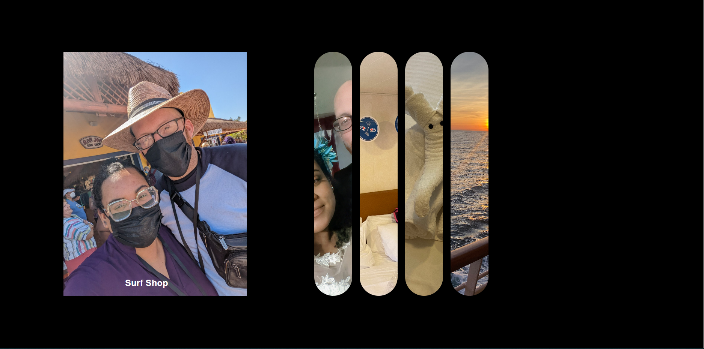

# Honeymoon
This is a simple panel slider that has been developed using HTML, CSS and JavaScript. I designed this site to just have fun and create something nice to remember my honeymoon by.

## Features
* Simple and clean design
* Use of CSS animations
* Use of JavaScript for interactive features
* Easy to use and intuitive 

## Technologies used
* HTML
* CSS
* JavaScript

## Installation
1. Clone the repository using the following command:

``` bash
https://github.com/TEkdahl92/Honeymoon.git
```
2. Open the project folder in your code editor.

3. Modify the HTML, CSS and JavaScript files as per your requirements.

4. Open the `index.html` file in your browser to view the site.

## Credits
* Google Fonts: https://fonts.google.com/

## Preview

